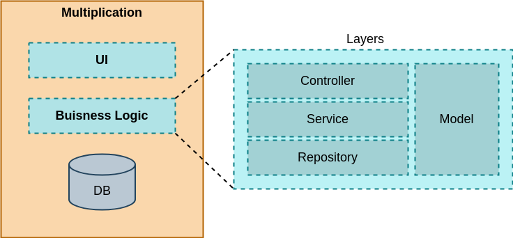

### Случайное умножение

### Технологии:
1. Spring Boot
2. H2
3. React

#### Схема компонента Multiplication
Сервис разделен на 3 уровня:
* Уровень представления (UI)
* Уровень бизнес-логики (Business Logic)
  * controller
  * service
  * repository
  * model
* Уровень хранения данных (DB)

